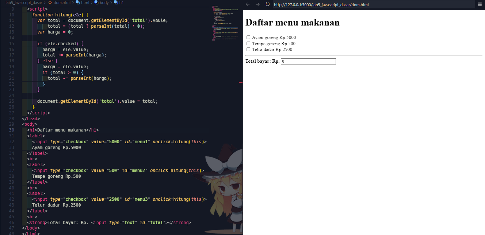

# Lab5Web

Dasar javascript

### Pengantar Javascript

Javascript adalah bahasa pemrograman yang awalnya dirancang untuk berjalan di atas browser. Namun, seiring perkembangan zaman, javascript tidak hanya berjalan di atas browser saja. Javascript juga dapat digunakan pada sisi Server, Game, IoT, Desktop, dsb.

JavaScript digunakan untuk memprogram perilaku halaman web, diantaranya adalah:

• Dapat Mengubah Konten HTML

• Dapat Mengubah Nilai Atribut HTML

• Dapat Mengubah Gaya HTML (CSS)

• Dapat Menyembunyikan Elemen HTML

• Dapat Menampilkan Elemen HTML

## Pengenalan Javascript

